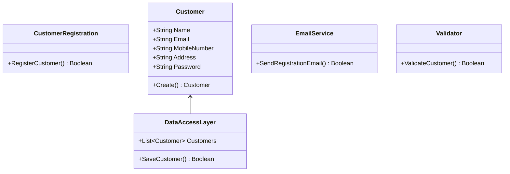

```mermaid
classDiagram

class CustomerRegistration
CustomerRegistration : +RegisterCustomer() Boolean

class Customer
Customer : +String Name
Customer : +String Email
Customer : +String MobileNumber
Customer : +String Address
Customer : +String Password
Customer : +Create() Customer

class DataAccessLayer
DataAccessLayer : +List~Customer~ Customers
DataAccessLayer : +SaveCustomer() Boolean

class EmailService
EmailService : +SendRegistrationEmail() Boolean

class Validator
Validator : +ValidateCustomer() Boolean


Customer <-- DataAccessLayer

```
