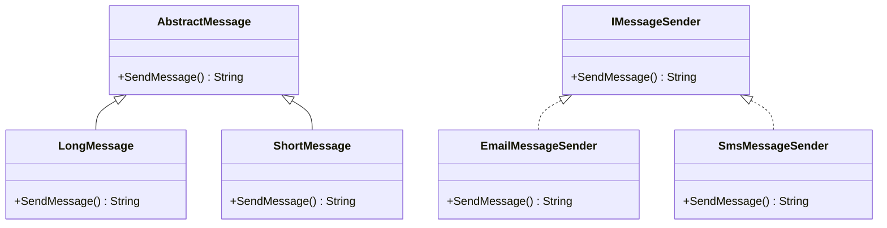

```mermaid
classDiagram

class AbstractMessage
AbstractMessage : +SendMessage() String

class EmailMessageSender
EmailMessageSender : +SendMessage() String

class IMessageSender
IMessageSender : +SendMessage() String

class LongMessage
LongMessage : +SendMessage() String

class ShortMessage
ShortMessage : +SendMessage() String

class SmsMessageSender
SmsMessageSender : +SendMessage() String


IMessageSender <|.. EmailMessageSender
AbstractMessage <|-- LongMessage
AbstractMessage <|-- ShortMessage
IMessageSender <|.. SmsMessageSender

```
